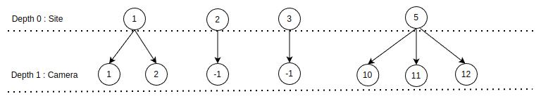
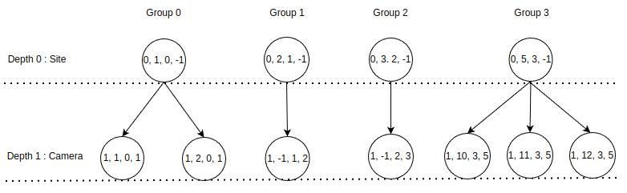
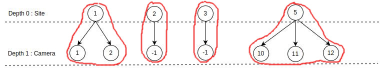
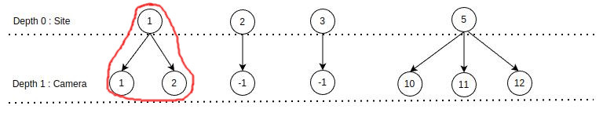
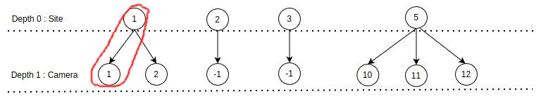
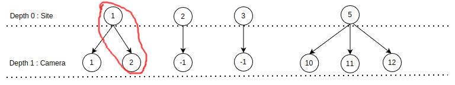
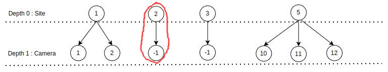
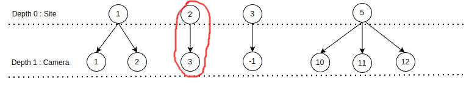

## **Enterprise Manager Service**
**Enterprise Manager API**

## **Requirements**
- hypercorn
- fastapi
- sqlalchemy
- sqlmodel
- pydantic
- redis
- argon2
- rsa
- pymysql
- aiomysql
- python-jose
- netifaces
- dynaconf
- valkka
- python-onvif
## **Installation**
```
python3 -m pip install -r requirements.txt
```
### **Install Valkka For Discovery Web Service (Camera)**
```
sudo apt-add-repository ppa:sampsa-riikonen/valkka
sudo apt-get update
sudo apt-get install valkka
python -m pip install zeep
```
- **Dependencies:**
```
sudo apt-get install git build-essential libc6-dev yasm cmake pkg-config swig libglew-dev mesa-common-dev python3-dev python3-numpy libasound2-dev libssl-dev coreutils valgrind pkg-config
```
- **resource** : [github](https://github.com/elsampsa/valkka-core), [docs](https://valkka.readthedocs.io/en/latest/onvif.html).
### **Install Python-Onvif For Get Web Service Profile (Camera)**
```
python -m pip install --upgrade onvif_zeep
```
- **resource** : [github](https://github.com/FalkTannhaeuser/python-onvif-zeep).
## **Structure Of Enterprise Manager Service**
- *main.py:* to run service
- *models.py:* contains object-relational mapping model for database access.
- *schemas.py:* contains some data object to validate body requests, responses.
- *dependencies.py:* contains dependencies for api endpoints.
- *routes:* contains api endpoints.
- *core:* contains database, helper functions, camera_discovery, custom_deamon for camera discovery, tag_qualifier_tree.
- *config:* contains database config, SECRET_KEY config.
- *camera_discovery:* contain functions to discovery cameras.
- *custom_daemon: * contains custom classes for web service discovery.
## **What The Enterprise Manager Service Do**
### **Enterprise API**
- Add new enterprise.
- Get all enterprise.
- Get enterprises by id or enterprise_code.
- Update enterprise information.
- Delete an enterprise.
### **Site API**
- Add new site.
- Get all site.
- Get all site belong to an enterprise.
- Get sites by id or site name.
- Update site information.
- Delete a site.
### **Camera API**
- Add new camera.
- Get all camera.
- Get all camera belong to an enterprise.
- Get all camera belong to an site.
- Get cameras by id, name, ip or description .
- Update camera information.
- Delete a camera.
## **How To Run**
- Build enterprise_service docker image.
```
docker build -t enterprise_service .
```
- Run enterprise_service container.
```
docker-compose up -d
```
## **API Endpoint Paths**
### **Link To Test API Endpoint**
- http://172.21.100.174:9083/docs
### **Enterprise API Endpoints Paths**
- ```/api/xface/v1/enterprises``` : POST an enterprise, GET enterprises, PUT an enterprise, DELETE an enterprise. 
  - GET method supports query parameters:
    - id: to get enterprise by id.
    - enterprise_code: to get enterprise by enterprise_code.
    - sort, search to sort and match enterprise by enterprise_code.
    - limit: to get limit number of enterprise in response.
  - PUT method requires *id* query parameter to update an enterprise:
  - DELETE method requires *id* query parameter to delete an enterprise:
### **Site API Endpoints Paths**
- ```/api/xface/v1/sites``` : POST a site, GET sites, PUT a site, DELETE a site. 
  - GET method supports query parameters:
    - enterprise_id: to get sites belong to an enterprise id.
    - id: to get site by id.
    - name: to get site by name.
    - sort, search to sort and match site by name.
    - limit: to get limit number of site in response.
  - PUT method requires *id* query parameter to update a site:
  - DELETE method requires *id* query parameter to delete a site:
### **Camera API Endpoints Paths**
- ```/api/xface/v1/cameras``` : POST a list of cameras, GET cameras, PUT a camera, DELETE a camera. 
  - GET method supports query parameters:
    - enterprise_id: to get cameras belong to an enterprise id.
    - site_id: to get cameras belong to a site id.
    - id: to get camera by id.
    - name: to get camera by name.
    - ip: to get camera by ip.
    - description: to get camera by description.
    - sort, search to sort and match site by name.
    - limit: to get limit number of site in response.
- ```/api/xface/v1/cameras/profiles``` : GET profile of a camera. GET method requires ip address of camera as a query parameter:
  - ip : to get profiles of a ip address.
- ```/api/xface/v1/cameras/discovery/local``` : GET METHOD to get discovery informations of all camera in the local network.
- ```/api/xface/v1/cameras/discovery/reliable``` : Discovery a camera regardless it has existed in database. GET METHOD requires ip address of camera to discovery as a query parameter:
  - ip : to discovery of a camera ip address.
- ```/api/xface/v1/cameras/discovery/unreliable``` : Discovery a camera if it has not existed in database. GET METHOD requires ip address of camera to discovery as a query parameter:
  - ip : to discovery of a camera ip address.

## **For Developper In Backend To Manage Resouces Access**
### **Step 1: Decode user authorization from token**
- Decode **_encoded_authorization_** in received token.
- Output of decode algorithm list of tag_qualifier array corresponding to tag_type of resouce and permissions that resouce requires.
- Example: With api for accessing camera resource. Backend developer will set tag_type of resource is **_'site.camera'_** (if camera and site has depend relationship one-to-many), and permission is **_'r'_**.
```
List of tag_qualifier array of vtx_user above after decoded is:
[[1,-1], [4,-1]]. 
```
- vtx_user can not access camera in site 2, 3 because he just has **_create_** and **_read_** permissions on that.
- Otherwise, he can access camera in site 1, 4 because he has **_admin_** permission in site 1, and **_read_** permission in all camera of site 4. 

### **Step 2: Create Tag Qualifier Trees From List Of tag_qualifier Array**
- **Assumed, we have user1 with permission like that:**

| username  | tag_type | tag_qualifier | permissions |
| :------------- | :------------- | :-------------: | :-------------: |
| user1  | site.camera  | 1.1 | crud |
| user1  | site.camera  | 1.2 | crud |
| user1  | site.camera  | 2.-1 | crud |
| user1  | site  | 3 | admin |
| user1  | site.camera  | 5.10 | crud |
| user1  | site.camera  | 5.11 | crud |
| user1  | site.camera  | 5.12 | crud |
| user1  | site  | 7 | -r-- |

- List of tag_qualifier array of user1 for access camera resouce : [1,1], [1,2], [2,-1], [3,-1], [5,10], [5,11], [5,12] we create user tag qualifier trees like that:



- We need relable trees to have all unique node. We use a tuple include 4 fields **(depth, qualifier id, group id, parent qualifier id)** to distinct all node in tree. After that, we can construct a user tag qualifier trees like that:



### **Step 3: Verify Query Params With Tag Qualifier Trees**
**With access control list of user1 above:**

- **Case 1:** If query params **[site_id, camera_id] = [None, None] (or [-1, -1])**. We will prune user tag qualifier tree by query params to get matched tree. In this case matched tree include all tag qualifier tree:



- **Case 2:** If query params **[site_id, camera_id] = [1, None] (or [1, -1])**. Matched tree is:



- **Case 3:** If query params **[site_id, camera_id] = [1, 1]**. Matched tree is:



- **Case 4:** If query params **[site_id, camera_id] = [1, 2]**. Matched tree is:



- **Case 5:** If query params **[site_id, camera_id] = [2, None] (or [2, -1])**. Matched tree is:



- **Case 6:** If query params **[site_id, camera_id] = [2, 3]**. Matched tree is:



- **Case 7:** If query params **[site_id, camera_id] = [5, 13]**. Matched tree is not found:

- **And another cases is similar above.**

### **Step 4: Convert Matched Trees To Condition Statement Query**
- **After Found Matched Tree. We convert matched trees to satisfied condition statement query. For each above case, we have condition statement is**

  - **Case 1:** (camera.site_id = 1 and (camera.id = 1 or camera.id = 2)) or (camera.site_id = 2) or (camera.site_id = 3) or (camera.site_id = 5 and (camera.id = 10 or camera.id = 11 or camera.id = 12))
  - **Case 2:** (camera.site_id = 1 and (camera.id = 1 or camera.id = 2))
  - **Case 3:** (camera.site_id = 1 and (camera.id = 1))
  - **Case 4:** (camera.site_id = 1 and (camera.id = 2))
  - **Case 5:** (camera.site_id = 2)
  - **Case 6:** (camera.site_id = 2 and (camera.id = 3))

- **We find condition statement query by using recursive function from root of matched tree to smallest children in the matched tree**
- **These functions look like that:**
```
# gender_query to create condition statement query.
def gender_query(tree):
    if tree.key[1] == -1 and tree.key[0] != -1:
        return ""
    id = ""
    if tree.key[1] != -1:
        id = tree.name + str(tree.key[1])

    sub_id = ""
    for child in tree.children:
        if sub_id == "":
            if id != "":
                sub_id += "( " + gender_query(child)
            else:
                sub_id += gender_query(child)
        else:
            sub_id += " or " + gender_query(child)
        
    if sub_id != "":
        if id == "":
            id = "(" + sub_id + ")"
        else:
            if sub_id != "( ":
                sub_id += " )"
                id  = "( " + id + " and " + sub_id + " )"   
    return id

# Labeling for site matched tree.
def site_labeling_tree(tree):
    if tree.key[0] == -1:
        tree.name = 'root'
    elif tree.key[0] == 0:
        tree.name = 'site.enterprise_id = '
    elif tree.key[0] == 1:
        tree.name = 'site.id = '
    for child in tree.children:
        site_labeling_tree(child)

# Create condition statement query by site matched tree. 
def site_tree_to_query(tree_list):
    root = Tree((-1,-1,-1,-1))
    root.name = 'root'
    for tree in tree_list:
        root.add_child(tree)
    site_labeling_tree(root)
    # call gender_query
    return gender_query(root)   
```

### **Summary**
**To verify query params with user tag qualifier authorization tree, we have 3 steps:**
- **Step 1:** Decode user authorization from token to get list of tag qualifier array.
- **Step 2:** Create **tag qualifier trees** from list of tag qualifier array.
- **Step 3:** Pruning **tag qualifier trees** by **query params** to get **matched trees**.
- **Step 4:** If **matched trees** is not empty. Convert **matched trees** to **condition statement query** to filter resource.